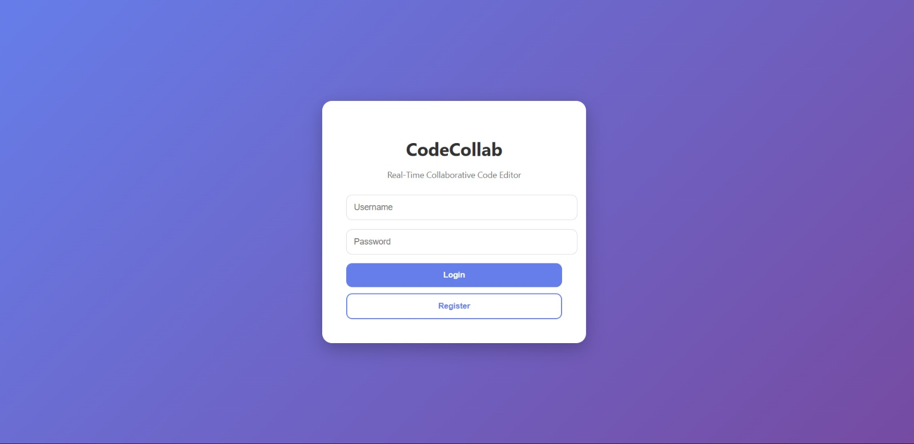
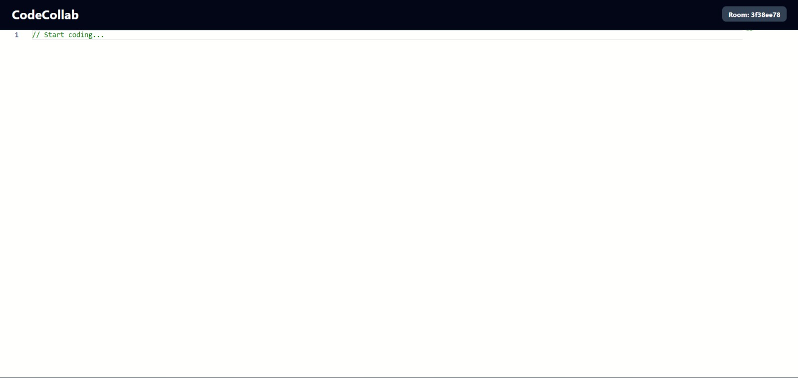
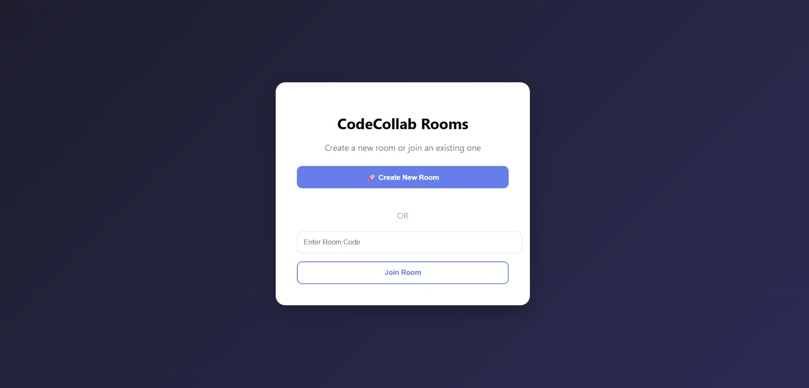

# 🚀 CodeCollab – Real-Time Collaborative Code Editor

CodeCollab is a full-stack real-time collaborative code editor that allows multiple users to join the same room and edit code simultaneously, similar to Google Docs but for programming.

This project demonstrates real-time WebSocket communication, full-stack deployment, and scalable collaboration architecture using React and Spring Boot.

---

## 🌐 Live Demo

* **Frontend:** https://code-collab-real-time-collaborative.vercel.app
* **Backend:** https://codecollab-backend-tvwl.onrender.com

---
## 📸 Screenshots

### 🔐 Login Page


### 🏠 Room Page


### 🧑‍💻 Collaborative Editor

## 📌 Features

* 🧑‍💻 Real-time collaborative code editing
* 🔄 Live code synchronization between users
* 🏠 Room-based collaboration system
* 🌍 Deployed full-stack application
* ⚡ WebSocket communication using STOMP & SockJS
* 🧩 Monaco Editor integration (VS Code-like editor)
* 🔐 Scalable backend architecture (Spring Boot)

---

## 🏗️ Tech Stack

### Frontend

* React.js
* Monaco Editor
* STOMP.js
* SockJS
* Axios
* Vercel (Deployment)

### Backend

* Spring Boot
* Spring WebSocket (STOMP + SockJS)
* Spring Security
* PostgreSQL
* Maven
* Render (Deployment)

### Database

* PostgreSQL (Neon / Supabase compatible)

---

## 📂 Project Structure

```
codecollab/
 ├── frontend/
 │   ├── src/
 │   │   ├── api/
 │   │   ├── pages/
 │   │   ├── components/
 │   │   └── App.jsx
 │   └── package.json
 │
 └── backend/
     ├── src/main/java/com/codecollab
     │   ├── config/
     │   ├── controller/
     │   ├── service/
     │   ├── websocket/
     │   ├── model/
     │   ├── repository/
     │   └── security/
     └── pom.xml
```

---

## ⚙️ How It Works

1. User creates or joins a room.
2. Frontend establishes a WebSocket connection using SockJS.
3. STOMP subscribes to `/topic/code/{roomId}`.
4. Any code change is published to `/app/edit`.
5. Backend broadcasts updates to all users in the same room.
6. Editor content syncs instantly across all clients.

---

## 🔌 WebSocket Architecture

---

## 🔌 WebSocket Architecture


## 🛠️ Environment Variables

### Frontend (.env)

```
REACT_APP_API_URL=https://codecollab-backend-tvwl.onrender.com
REACT_APP_WS_URL=https://codecollab-backend-tvwl.onrender.com
```

### Backend (application.yml)

```
spring:
  datasource:
    url: jdbc:postgresql://<DB_HOST>:5432/codecollab
    username: <USERNAME>
    password: <PASSWORD>
```

---

## 🚀 Getting Started Locally

### 1️⃣ Clone Repository

```
git clone https://github.com/venkatesh-reddy-prog/CodeCollab-Real-Time-Collaborative-Code-Editor.git
cd CodeCollab-Real-Time-Collaborative-Code-Editor
```

### 2️⃣ Run Backend

```
cd backend
mvn spring-boot:run
```

### 3️⃣ Run Frontend

```
cd frontend
npm install
npm start
```

Frontend runs on: `http://localhost:3000`
Backend runs on: `http://localhost:8080`

---

## 📡 API Endpoints

| Method | Endpoint               | Description               |
| ------ | ---------------------- | ------------------------- |
| POST   | `/api/rooms`           | Create room               |
| GET    | `/api/rooms/{roomId}`  | Join room                 |
| WS     | `/ws`                  | WebSocket endpoint        |
| SUB    | `/topic/code/{roomId}` | Subscribe to code updates |
| PUB    | `/app/edit`            | Publish code changes      |

---

## 🧪 Testing Real-Time Collaboration

1. Open app in two browser tabs
2. Join the same room ID
3. Start typing in one tab
4. Changes appear instantly in the other tab

---

## 🧱 Deployment Architecture

```
Frontend (Vercel)
        ↓
Spring Boot Backend (Render)
        ↓
PostgreSQL Database (Neon / Supabase)
```

---

## 🔐 Security & CORS

* Global CORS enabled for frontend domain
* WebSocket endpoint allows cross-origin communication
* JWT authentication can be added for secure rooms

---

## 📈 Future Enhancements

* 👥 Show active users in room
* 💬 Real-time chat feature
* 🖱️ Live cursor tracking
* 💾 Auto-save code to database
* 🔐 Authentication with JWT
* 📁 Multi-file collaborative editing

---

## 🐞 Challenges Faced

* WebSocket connection timing issues
* SockJS handshake & CORS configuration
* Environment variable mismatch during deployment
* Render cold start delays affecting WebSocket connection

All issues were resolved through proper environment configuration, backend CORS setup, and reconnection handling logic.

---

## 📚 Key Concepts Demonstrated

* Real-time systems with WebSockets
* Pub/Sub messaging architecture
* Full-stack deployment (CI/CD with GitHub + Vercel + Render)
* State synchronization across distributed clients
* Scalable collaborative editing design

---

## 👨‍💻 Author

**B. Venkatesh Reddy**
GitHub: https://github.com/venkatesh-reddy-prog

---

## ⭐ Show Your Support

If you like this project, give it a ⭐ on GitHub and share with others!
